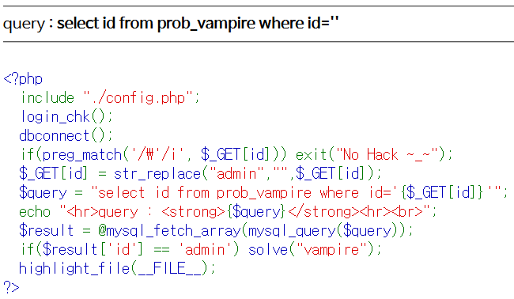
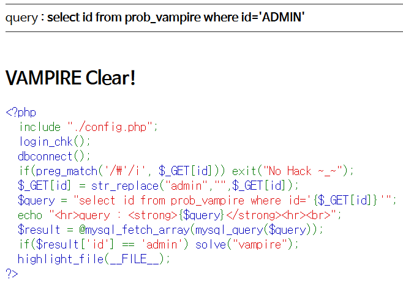

# Level 9 - Vampire

## 문제



## 문제 의도

- php 소스를 읽을 줄 아는가?
- str_replace() 함수의 취약점을 이용할 수 있는가?

## 코드 분석

```php
<?php
  include "./config.php";
  login_chk();
  dbconnect();
  if(preg_match('/\'/i', $_GET[id])) exit("No Hack ~_~");
  $_GET[id] = str_replace("admin","",$_GET[id]);
  /* str_replace() 함수는 인자로 받은 정규표현식에 맞는 문자열을
    찾아 치환하는함수이다. 여기선 GET으로 받은 id필드의 값에
    'admin'이 있으면 'admin'을 ''으로 치환하도록 되어있다.*/
  $query = "select id from prob_vampire where id='{$_GET[id]}'";
  echo "<hr>query : <strong>{$query}</strong><hr><br>";
  $result = @mysql_fetch_array(mysql_query($query));
  if($result['id'] == 'admin') solve("vampire");
  highlight_file(__FILE__);
?>
```

## 문제 풀이

str_replace() 함수도 Troll문제의 ereg() 함수와 마찬가지로 찾을 문자열의 **대소문자 구분을 한다**. str_replace() 함수로 대소문자 구분을 하려면 str_ireplace() 함수를 사용하면 된다. 그래서 ereg() 함수와 같은 맥락으로 대소문자 구분 여부를 인자로 받는 preg_replace() 함수가 있다. 아무튼 여기서도 "admin"과 "ADMIN"을 구분하기 때문에 GET으로 id필드에 **"ADMIN"** 을 주면 str_replace()를 그냥 통과할 수 있다.

### 다른 방법

GET으로 id필드에 값을 줬을때, str_replace() 함수는 'admin'이란 문자열이 존재하면 ''으로 치환한다. 그러면 이를 이용해 'admin'이란 문자열이 삭제되야 진짜 'admin'이 되도록 만들면 되지 않을까? 만약 **'ad _admin_ min'** 을 넘겨 준다면, str_replace() 함수는 'admin'을 삭제하므로 'ad _admin_ min'은 **'admin'** 이 된다ㅎㅎㅎ

