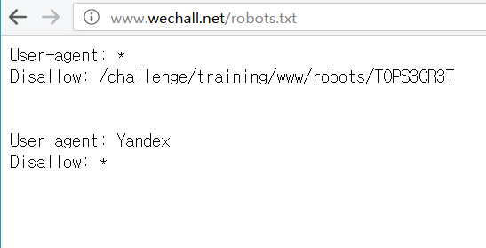
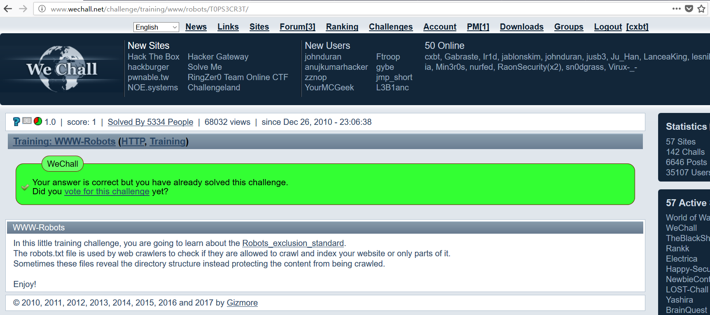

# WeChall Writeup
## Training : WWW-Robots
### Problem
```
In this little training challenge, you are going to learn about the Robots_exclusion_standard.
The robots.txt file is used by web crawlers to check if they are allowed to crawl and index your website or only parts of it.
Sometimes these files reveal the directory structure instead protecting the content from being crawled.

Enjoy!
```
### Solution
#### What is Robots.txt?

> The robots exclusion standard, also known as the robots exclusion protocol or simply robots.txt, is a standard used by websites to communicate with web crawlers and other web robots.
> <sub>Wikipedia, [Robots exclusion standard](https://en.wikipedia.org/wiki/Robots_exclusion_standard)</sub>


#### Solving Caesar Cipher
As problem says that I'm going to learn about this Robots Exclusion Standard, I might have to see [wechall's robots.txt](http://www.wechall.net/robots.txt).



First sentence first. `/challenge/training/www/robots/T0PS3CR3T` directory is not allowed for robots with all kinds of User-Agent to access, which prevent search engine to acknowledge it. However, we can browse robot-banned directories normally. In addition, if you see next line of robots.txt, you can presume that all robots with User-Agent `Yandex` cannot scan the whole website.

Why did administrator blocked `/challenge/training/www/robots/T0PS3CR3T` to be read? Maybe he didn't wanted bots to reveal that.

Challenge will be automatically solved when you access there.


### Reference

[Wikipedia :: Robots exclusion standard](https://en.wikipedia.org/wiki/Robots_exclusion_standard)